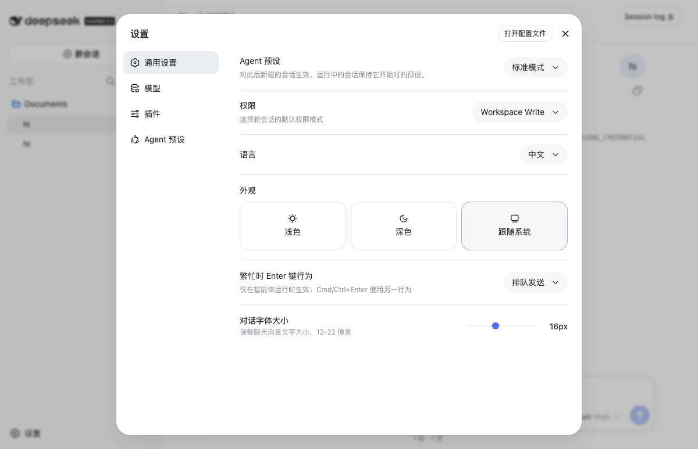
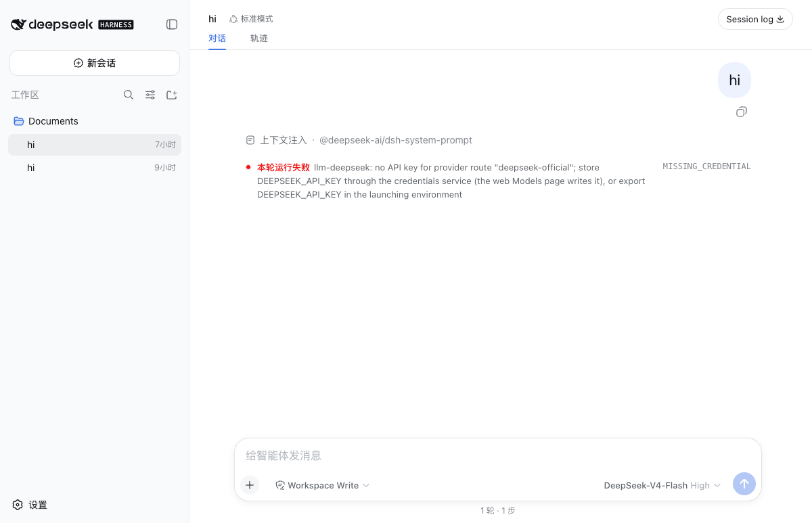
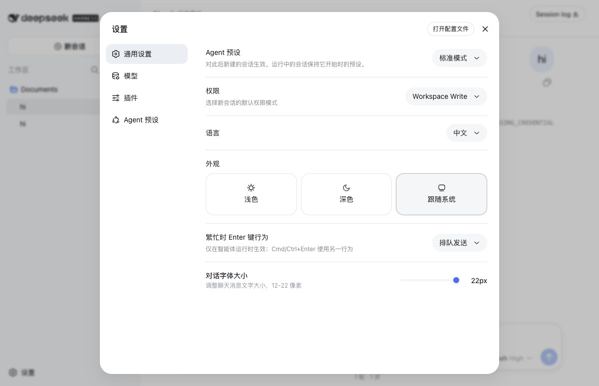

# dsh-font-size

DeepSeek Harness 聊天字体大小调节插件。**设置 → 通用** → 「对话字体大小」滑块，**12–22 px**，拖动立即生效。

| 默认 16 px | 调至 22 px |
| --- | --- |
|  |  |

设置面板新增一行：



## 它能干什么

把页面所有聊天消息（用户气泡 + 助手正文）统一放大/缩小。一个滑块管全部，对话视图与轨迹视图一致跟随。默认 16 px，范围 12–22 px，整数步进。

字号选择存在浏览器本地，**每个浏览器独立保存**；切换浏览器或清空站点数据后回到默认。

## 工作原理

`packages/client/ui-conversation` 把 `font-size: 16px` 硬编码在 `MessageItem.module.css` 的 `.bubble` 和 `AssistantMarkdown.module.css` 的 `.root` 里，没有暴露 CSS 变量。

本插件只做一件事：注入一段全局 `<style>`，用 `[class*="_bubble"]` + `[data-streaming]` 两个属性选择器把硬编码覆盖掉，再加 `!important` 赢级联。**不**改 core 源码，**不**升级 core。

```css
[data-streaming],
[class*="_bubble"] {
  font-size: var(--dsh-plugin-font-size, 16px) !important;
  line-height: calc(var(--dsh-plugin-font-size, 16px) * 1.5) !important;
}
```

实现细节：[`src/client/index.ts`](src/client/index.ts)。设置 UI 走 core 提供的 `settings.general.item` slot，浏览器启动时挂上去。

## 目录

```
dsh-font-size/
├── package.json        # dsh.bundle + dsh.client 声明
├── cordis.patch.yml    # bundle 层插入 ui-font-size
├── lib/index.js        # 宿主半边（空 stub，仅注册 bundle）
├── lib/client.js       # 浏览器半边：slot 注册 + CSS 注入 + localStorage
├── docs/               # README 截图
└── README.md
```

## 安装 / 卸载

```sh
# 安装
dsh plugin --profile web add github:chengoak/dsh-font-size

# 本地开发
dsh plugin --profile web add link:$(pwd)

# 卸载
dsh plugin --profile web remove dsh-font-size
```

装完重启 `dsh web`（`dsh web --port 3080`），打开 `http://127.0.0.1:3080/`，「设置 → 通用」里就能看到「对话字体大小」一行。

`lib/` 已 build 进 git，安装无需构建授权。`pnpm` 装包由 dsh 内部转发；如果你是从 deepseek-harness 源码仓库跑 dsh，把上面 `dsh` 替换成 `pnpm dsh`。

## 已知边界

- 暂未走 core 的 settings namespace，**跨浏览器/跨设备不共享**字号。
- 只覆盖聊天消息（用户气泡 + 助手正文）；侧边栏、设置面板、输入框的字号不在调节范围。
- 核心样式未来若改成 CSS 变量，选择器会失效，需同步更新。

## License

MIT.
